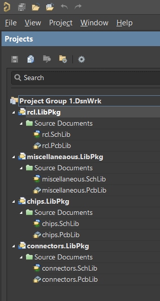

# Altium_Libraries
[](https://opensource.org/licenses/MIT)
<br><br>
Set of 4 Altium-Designer libraries.
<br><br>
<p align="center"></p>

## Content
Altium-Designer libraries used in this github account's projects.
<br> <br>

### chips.LibPkg
Contains ICs such as MCU, regulators, transistors, etc..
<br> <br>

### connectors.LibPkg
Contains (surprise) connectors, FFC, USB, pin header, etc...
<br> <br>

### rcl.LibPkg
Contains resistors, inductors, capacitors, mainly in 0603 and 0402 packages.
<br> <br>

### miscellaneaous.LibPkg
Contains Antenna, vibration motors, batteries, and others which don't fit in any of the above categories.
<br> <br>

## Layer definition
In these libraries, all components obey the same layer definitions and only use 7 layers:<br>
```
1   - Top <br>
2   - Bottom <br>
n/a - Top and Bottom overlay <br>
M15 - Top Assembly <br>
M16 - Bottom Assembly (rarely used) <br>
M13 - 3D Body <br>
n/a - MultiLayer (mainly for holes) <br>
```
This way, designs are clean and consistents while containing all the necessary data for the manufaturer without cluttering the screen and generated files. Plus, adding a new component does not require hours of work.

## Supplier 
(All components are linked to a supplier)<br>
90% Digikey<br>
8% Mouser<br>
2% Others

## Add a component to this library
Please follow this <a href="https://github.com/pseudoincorrect/Altium_Libraries/Support/Adding_Part_Guide.txt">Guide</a>.
<br>
It is extremely important to use the same layers (in PCB Lib) and same colors/fonts (in Schematic Lib).
<br>
The main reason is that, if we don't follow the exact same layers/parameter set for each and every components of our libraries, when your send your data to any manafacturer, it is going to be really painful and time consumming to generate and re-generate correct Gerbers files and BOMs. (Trust me, been there).